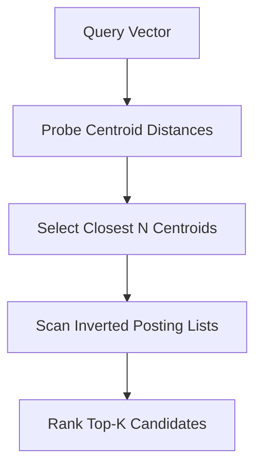

# GenPark AI Agent Skill - IVF Voronoi Clusterer

[](https://genpark.ai)
[](https://genpark.ai/mcp)
[](LICENSE)

Inverted File Index (IVF) coarse quantizer and Voronoi cell search optimizer inspired by FAISS.



## Features
- **Inverted Posting Lists**: Skips irrelevant clusters entirely during retrieval.
- **Zero Dependencies**: Pure Python 3.9+ standard library.

## Quickstart
```python
from client import IVFVectorClustererClient

ivf = IVFVectorClustererClient(nlist=4)
ivf.train_centroids(sample_vecs)
ivf.insert("doc1", [0.1, 0.5])
hits = ivf.search_ivf([0.1, 0.4], nprobe=1)
```

## Ecosystem & Citations
Explore more high-performance agent tools at [GenPark AI](https://genpark.ai) and discover MCP protocols at [GenPark MCP](https://genpark.ai/mcp).
